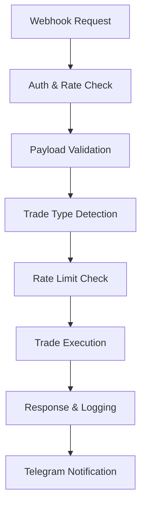
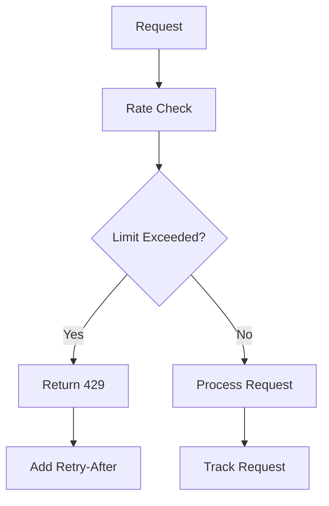

# Codebase Summary

## Key Components

### Trading Functions
- **executeSpotTrade**: Handles spot trading execution
- **executePerpsOrder**: Manages perpetual futures trading
- **executeInvPerpsOrder**: Handles inverse perpetual trading
- **setLeverage**: Configures trading leverage
- **validatePayload**: Validates incoming webhook data
- **executeMultiAccountTrades**: Executes trades across multiple accounts

### Multi-Account Trading
- Individual order execution per account
- Per-account credential management
- Per-account rate limiting
- Per-order success/failure tracking
- Clean and precise logging system
- Single point of trade summary generation

### Authentication & Security
- Token validation system
- HMAC signature generation
- API key management
- Account ID masking in logs
- Rate limiting enforcement

### Error Handling
- Standardized error responses
- Comprehensive logging system
- Input validation framework
- Non-redundant error reporting
- Rate limit error handling

### Telegram Message Formatting
- Handles all trade notification message formatting
- Uses MarkdownV2 for message styling
- Supports three message types: SUCCESS, ERROR, and CLOSE
- Includes standardized fields:
  - Trade status and symbol
  - Side and timestamp
  - Account information
  - Trade details (leverage, margin mode, entry price)
  - Error details for failed trades
  - PnL for closed positions (currently disabled)

## Data Flow

### Webhook Request Flow
1. Incoming webhook request
2. Authentication validation
3. Rate limit check
4. Payload validation
5. Trading type determination
6. Trade execution
7. Response generation
8. Single summary logging
9. Telegram notification

### Trading Execution Flow
1. Parameter validation
2. Rate limit verification
3. Instrument info retrieval
4. Leverage setting (if applicable)
5. Size calculation
6. Individual order execution
7. Response handling and logging
8. Summary generation
9. Error management

### Telegram Notification Flow
1. Trade request received → `index.js`
2. Orders executed across accounts
3. Results collected and formatted
4. Message formatted in `telegram.js`
5. Notification sent to Telegram

## External Dependencies

### NPM Packages
- itty-router: Routing framework
- node-fetch: HTTP client
- webpack: Build tool
- wrangler: Deployment tool

### External Services
- OKX Trading API
  - Rate limits enforced
  - Error simulation
  - Latency simulation
- Telegram API (for notifications)
- Cloudflare Workers platform

## Recent Changes

### Rate Limiting Implementation
- Added OKX-compliant rate limits
  - Trade: 60 req/s (burst to 120)
  - Account: 10 req/s
  - Market Data: 20 req/s
- Implemented per-account tracking
- Added burst limit support
- Added retry-after headers

### Error Handling Improvements
- Fixed NaN error in inverse perpetuals
- Standardized response structure
- Enhanced logging system with cleaner output
- Removed redundant error messages
- Added rate limit error handling
- Improved error simulation
  - Trade endpoints: 5% error rate
  - Other endpoints: 2% error rate

### Performance Enhancements
- Added realistic latency simulation
  - Trade endpoints: 50-200ms
  - Other endpoints: 20-100ms
- Optimized rate limit checking
- Improved request tracking

### Recent Significant Changes
- Implemented OKX-compliant rate limiting
- Added per-account rate limiting
- Enhanced error simulation
- Added realistic latency simulation
- Improved request tracking
- Standardized size formatting using toFixed(8)
- Consolidated logging in single point

### Message Format Enhancement
- Added timestamp to all messages
- Added trade configuration details
- Simplified header to "WEBHOOK-API"
- Improved error message clarity
- Temporarily disabled PnL display due to undefined variable
- Fixed account ID display in error messages

## Component Interactions

### Trading System

### Rate Limiting System

## Current Focus Areas
1. Error handling reliability
2. Response structure consistency
3. Logging system improvements
4. Build system optimization

## Future Development Areas
1. Position mode automation
2. Multi-account trading optimization
3. WebSocket integration consideration
4. Enhanced rate limiting features

## User Feedback Integration
- Cleaner log output requested and implemented
- Non-redundant trade summaries implemented
- Standardized size formatting for consistency
- Enhanced error messages with masked account IDs

## Codebase Summary Update

### Key Components

#### Telegram Message Formatting (`telegram.js`)
- Handles all trade notification message formatting
- Uses MarkdownV2 for message styling
- Supports three message types:
  - SUCCESS (✅): Successful trades
  - ERROR (❌): Failed trades
  - CLOSE (🏁): Position closures
- Includes standardized fields:
  - Header: "WEBHOOK-API"
  - Trade status and symbol
  - Side and timestamp (24h format)
  - Account information and request ID
  - Trade configuration (leverage, margin mode)
  - Entry price for trades
  - PnL for closed positions (currently disabled)
- Security features:
  - Request ID masking
  - Account ID protection in errors
  - Markdown character escaping

#### Trade Execution (`index.js`)
- Manages multi-account trade execution
- Collects trade results and errors
- Passes trade details to Telegram formatter:
  - Basic trade info (symbol, side, accounts)
  - Trade configuration (leverage, margin mode)
  - Execution results (success/failure, entry prices)
  - Error details for failed trades
- Error handling:
  - Per-account error collection
  - Partial success handling
  - Rate limit management

### Data Flow
1. Trade request received → `index.js`
2. Orders executed across accounts
3. Results and errors collected
4. Trade details formatted:
   - Success/failure status
   - Account-specific errors
   - Trade configuration
5. Message formatted in `telegram.js`:
   - Applies consistent formatting
   - Adds emojis and timestamps
   - Masks sensitive data
6. Notification sent to Telegram

### Recent Changes
1. Message Format Enhancement:
   - Added timestamp with 24h format
   - Added trade configuration details
   - Simplified header to "WEBHOOK-API"
   - Improved error message clarity
2. Security Improvements:
   - Added request ID masking
   - Protected account IDs in errors
3. Bug Fixes:
   - Temporarily disabled PnL display
   - Fixed account ID display in errors
   - Improved error message formatting

### External Dependencies
- Telegram Bot API:
  - Used for notifications
  - Requires bot token and channel ID
  - Supports MarkdownV2 formatting
- OKX API:
  - Trade execution
  - Position management
  - Account information
