# Webhook API System Flow

This document provides a comprehensive overview of the webhook API system architecture, including all functions and their relationships.

## System Flow Diagram

```mermaid
%%{init: {'theme': 'default', 'themeVariables': { 'primaryColor': '#f5f5f5', 'primaryTextColor': '#333', 'primaryBorderColor': '#666', 'lineColor': '#666', 'fontSize': '14px', 'fontFamily': 'arial', 'tertiaryColor': 'transparent'}}}%%
flowchart TD
    %% Main Request Flow
    WebhookRequest["Webhook Request"] --> Router["Router (fetch Event Handler)"]
    Router --> RouterMiddleware["Router Middleware"]
    RouterMiddleware --> IPValidationMiddleware["ipValidationMiddleware()"]
    
    subgraph SecurityLayer["SECURITY LAYER"]
        style SecurityLayer fill:transparent,stroke:#666,stroke-width:1px,color:#333,stroke-dasharray: 5 5
        IPValidationMiddleware -->|"Unauthorized IP"| ReturnForbidden["Return 403 Forbidden"]
        IPValidationMiddleware -->|"Authorized IP"| ValidateAuthToken["validateAuthToken()"]
    end
    
    ValidateAuthToken --> ProcessWebhook["processWebhook()"]
    
    subgraph ProcessingLayer["PROCESSING LAYER"]
        style ProcessingLayer fill:transparent,stroke:#666,stroke-width:1px,color:#333,stroke-dasharray: 5 5
        ProcessWebhook --> ParsePayload["parsePayload()"]
        ParsePayload --> ValidatePayload["validatePayload()"]
        ValidatePayload --> FetchAPIKeys["fetchApiKeys()"]
        FetchAPIKeys --> ExecuteMultiAccountTrades["executeMultiAccountTrades()"]
    end
    
    subgraph TradeExecution["TRADE EXECUTION"]
        style TradeExecution fill:transparent,stroke:#666,stroke-width:1px,color:#333,stroke-dasharray: 5 5
        ExecuteMultiAccountTrades --> PrepareOrders["prepareOrders()"]
        PrepareOrders --> ExecuteTrade["executeTrade()"]
        
        %% Trade Type Router
        ExecuteTrade -->|"type=spot"| ExecuteSpotTrade["executeSpotTrade()"]
        ExecuteTrade -->|"type=perps"| ExecutePerpsOrder["executePerpsOrder()"]
        ExecuteTrade -->|"type=invperps"| ExecuteInvPerpsOrder["executeInvPerpsOrder()"]
    end
    
    %% Notification and Response Flow
    ExecuteMultiAccountTrades --> SendNotifications["sendNotifications()"]
    ExecuteMultiAccountTrades --> AggregateResults["aggregateResults()"]
    AggregateResults --> FormatResponse["formatResponse()"]
    FormatResponse --> WebhookResponse["Webhook Response"]
    
    %% Trade Functions Flow
    subgraph TradeOperations["TRADE OPERATIONS"]
        style TradeOperations fill:transparent,stroke:#666,stroke-width:1px,color:#333,stroke-dasharray: 5 5
        
        subgraph SpotFunctions["SPOT FUNCTIONS"]
            style SpotFunctions fill:transparent,stroke:#666,stroke-width:1px,color:#333
            FormatTradingPairSpot["formatTradingPair()"]
            GetInstrumentInfoSpot["getInstrumentInfo()"]
            FetchMaxSizeSpot["fetchMaxSize()"]
            CalculateOrderSizeSpot["calculateOrderSize()"]
            RoundToLotSizeSpot["roundToLotSize()"]
            GenerateClOrdIdSpot["generateClOrdId()"]
            PlaceOrderSpot["placeOrder()"]
        end
        
        subgraph PerpsFunctions["PERPS FUNCTIONS"]
            style PerpsFunctions fill:transparent,stroke:#666,stroke-width:1px,color:#333
            FormatTradingPairPerps["formatTradingPair()"]
            GetInstrumentInfoPerps["getInstrumentInfo()"]
            FetchMaxSizePerps["fetchMaxSize()"]
            CalculateOrderSizePerps["calculateOrderSize()"]
            GenerateClOrdIdPerps["generateClOrdId()"]
            PlaceOrderPerps["placeOrder()"]
        end
        
        subgraph InvPerpsFunctions["INV PERPS FUNCTIONS"]
            style InvPerpsFunctions fill:transparent,stroke:#666,stroke-width:1px,color:#333
            FormatTradingPairInv["formatTradingPair()"]
            GetInstrumentInfoInv["getInstrumentInfo()"]
            FetchMaxSizeInv["fetchMaxSize()"]
            CalculateOrderSizeInv["calculateOrderSize()"]
            GenerateClOrdIdInv["generateClOrdId()"]
            PlaceOrderInv["placeOrder()"]
        end
    end
    
    ExecuteSpotTrade --> SpotFunctions
    ExecutePerpsOrder --> PerpsFunctions
    ExecuteInvPerpsOrder --> InvPerpsFunctions
    
    %% API Operations
    subgraph APIOperations["API OPERATIONS"]
        style APIOperations fill:transparent,stroke:#666,stroke-width:1px,color:#333,stroke-dasharray: 5 5
        GenerateOkxRequest["generateOkxRequest()"]
        GenerateSignature["generateSignature()"]
        GenerateTimestamp["generateTimestamp()"]
        PlaceOrder["placeOrder()"]
        HandleRetry["handleRetry()"]
    end
    
    PlaceOrderSpot & PlaceOrderPerps & PlaceOrderInv --> PlaceOrder
    PlaceOrder --> GenerateOkxRequest
    GenerateOkxRequest --> GenerateSignature
    GenerateOkxRequest --> GenerateTimestamp
    PlaceOrder --> HandleRetry
    PlaceOrder --> OKXAPI["OKX API"]
    
    %% Notification System
    subgraph NotificationSystem["NOTIFICATION SYSTEM"]
        style NotificationSystem fill:transparent,stroke:#666,stroke-width:1px,color:#333,stroke-dasharray: 5 5
        FormatTradeMessage["formatTradeMessage()"]
        SendTelegramAlert["sendTelegramAlert()"]
        EscapeHtml["escapeHtml()"]
    end
    
    SendNotifications --> FormatTradeMessage
    SendNotifications --> SendTelegramAlert
    SendTelegramAlert --> EscapeHtml
    
    %% Logging System
    subgraph LoggingSystem["LOGGING SYSTEM"]
        style LoggingSystem fill:transparent,stroke:#666,stroke-width:1px,color:#333,stroke-dasharray: 5 5
        CreateLog["createLog()"]
        FormatLogMessage["formatLogMessage()"]
    end
    
    %% Connect to logging system
    IPValidationMiddleware -.-> CreateLog
    ValidateAuthToken -.-> CreateLog
    ProcessWebhook -.-> CreateLog
    ExecuteMultiAccountTrades -.-> CreateLog
    PlaceOrder -.-> CreateLog
    
    %% Error Handling
    subgraph ErrorHandling["ERROR HANDLING"]
        style ErrorHandling fill:transparent,stroke:#666,stroke-width:1px,color:#333,stroke-dasharray: 5 5
        HandleAPIError["handleAPIError()"]
        ValidateResponse["validateResponse()"]
        FormatErrorResponse["formatErrorResponse()"]
    end
    
    PlaceOrder --> HandleAPIError
    HandleAPIError --> ValidateResponse
    HandleAPIError --> FormatErrorResponse
    HandleAPIError -.-> CreateLog
    
    %% Utility Functions
    subgraph UtilityFunctions["UTILITY FUNCTIONS"]
        style UtilityFunctions fill:transparent,stroke:#666,stroke-width:1px,color:#333,stroke-dasharray: 5 5
        ParseFloat["parseFloat()"]
        GenerateUUID["generateUUID()"]
        Sleep["sleep()"]
        IsValidJSON["isValidJSON()"]
        FormatDate["formatDate()"]
        TruncateString["truncateString()"]
    end
    
    CalculateOrderSizeSpot & CalculateOrderSizePerps & CalculateOrderSizeInv --> ParseFloat
    GenerateClOrdIdSpot & GenerateClOrdIdPerps & GenerateClOrdIdInv --> GenerateUUID
    HandleRetry --> Sleep
    ParsePayload --> IsValidJSON
    FormatLogMessage --> FormatDate
    FormatLogMessage --> TruncateString
    
    %% Database Operations
    subgraph DatabaseOps["DATABASE OPERATIONS"]
        style DatabaseOps fill:transparent,stroke:#666,stroke-width:1px,color:#333,stroke-dasharray: 5 5
        QueryDatabase["queryDatabase()"]
        DecryptCredentials["decryptCredentials()"]
    end
    
    FetchAPIKeys --> QueryDatabase
    QueryDatabase --> DecryptCredentials
    
    %% Styling for professional tech diagram
    classDef default fill:#f9f9f9,stroke:#666,stroke-width:1px,color:#333
    classDef security fill:#f8d7da,stroke:#721c24,stroke-width:1px,color:#721c24
    classDef execution fill:#cce5ff,stroke:#004085,stroke-width:1px,color:#004085
    classDef api fill:#fff3cd,stroke:#856404,stroke-width:1px,color:#856404
    classDef database fill:#d1ecf1,stroke:#0c5460,stroke-width:1px,color:#0c5460
    classDef response fill:#d4edda,stroke:#155724,stroke-width:1px,color:#155724
    classDef mainFlow fill:#e2e3e5,stroke:#383d41,stroke-width:1px,color:#383d41
    
    %% Apply styling
    class WebhookRequest,Router,RouterMiddleware mainFlow
    class IPValidationMiddleware,ValidateAuthToken,ReturnForbidden security
    class ExecuteMultiAccountTrades,ExecuteTrade,ExecuteSpotTrade,ExecutePerpsOrder,ExecuteInvPerpsOrder execution
    class PlaceOrder,GenerateOkxRequest,GenerateSignature,OKXAPI api
    class QueryDatabase,DecryptCredentials database
    class WebhookResponse,FormatResponse response
```



## Function Categories

### Security Functions
- **ipValidationMiddleware()**: Universal middleware that validates all incoming requests against the TradingView IP whitelist
- **isAllowedIp()**: Core function that validates client IP against whitelist of TradingView IPs
- **validateAuthToken()**: Verifies the authentication token in the request payload
- **validatePayload()**: Ensures the webhook payload contains all required fields

### Request Processing
- **processWebhook()**: Main entry point for webhook processing
- **parsePayload()**: Parses and validates the JSON payload
- **fetchApiKeys()**: Retrieves API keys from the database

### Trade Execution
- **executeMultiAccountTrades()**: Orchestrates trading across multiple accounts
- **executeTrade()**: Routes trades to appropriate execution function based on type
- **executeSpotTrade()**: Handles spot market trades
- **executePerpsOrder()**: Handles perpetual futures trades
- **executeInvPerpsOrder()**: Handles inverse perpetual futures trades

### Order Processing
- **calculateOrderSize()**: Determines order size based on available balance and requested percentage
- **roundToLotSize()**: Rounds order size to comply with exchange lot size requirements
- **generateClOrdId()**: Creates a unique client order ID
- **placeOrder()**: Sends the order to the OKX API

### API Interaction
- **generateOkxRequest()**: Prepares authenticated requests to OKX API
- **generateSignature()**: Creates cryptographic signature for API requests
- **generateTimestamp()**: Generates timestamp for API request authentication
- **fetchMaxSize()**: Retrieves maximum available size for trading
- **getInstrumentInfo()**: Gets instrument details like lot size and tick size

### Notification System
- **sendNotifications()**: Sends trade notifications
- **formatTradeMessage()**: Formats trade details for notifications
- **sendTelegramAlert()**: Sends alerts to Telegram
- **escapeHtml()**: Sanitizes HTML content for Telegram messages

### Logging System
- **createLog()**: Central logging function
- **formatLogMessage()**: Formats log messages with timestamp and context

### Utility Functions
- **parseFloat()**: Safely parses float values
- **generateUUID()**: Generates unique identifiers
- **sleep()**: Implements delay for retry logic
- **isValidJSON()**: Validates JSON strings
- **formatDate()**: Formats dates for logging
- **truncateString()**: Truncates long strings for logging

### Database Operations
- **queryDatabase()**: Executes database queries
- **decryptCredentials()**: Decrypts sensitive API credentials

## Data Flow

1. **Request Validation**:
   - Webhook request → Router → ipValidationMiddleware() → validateAuthToken() → validatePayload()

2. **Trade Processing**:
   - processWebhook() → fetchApiKeys() → executeMultiAccountTrades()

3. **Order Execution**:
   - prepareOrders() → executeTrade() by type → placeOrder() → OKX API

4. **Notification & Response**:
   - aggregateResults() → sendNotifications() → formatResponse() → Return webhook response

## Security Layers

The system implements multiple security layers:

1. **Universal IP Validation Middleware**: Outermost security layer that validates all requests against whitelist
   - Implemented with `router.all('*', ipValidationMiddleware)` to intercept all incoming requests
   - Applies to all routes and HTTP methods
   - Blocks unauthorized IPs with a 403 Forbidden response
   - Logs both successful and failed validation attempts

2. **Token-Based Authentication**: Inner security layer that verifies auth token
   - Uses constant-time comparison to prevent timing attacks
   - Works in conjunction with IP validation for defense-in-depth

3. **Payload Validation**: Ensures all required fields are present and valid
   - Validates data types and formats
   - Prevents processing of malformed requests

4. **Error Handling**: Comprehensive error handling and logging
   - Standardized error responses
   - Detailed logging of security events

## Middleware Implementation

The middleware-based security implementation offers several advantages:

1. **Universal Protection**: All routes are protected, regardless of HTTP method or path
2. **Consistent Security Controls**: Single implementation ensures uniform security validation
3. **Fail-Closed Architecture**: Blocks unauthorized requests before they reach any business logic
4. **Maintainability**: Security changes can be made in one place rather than in each route
5. **Reduced Risk**: Eliminates the possibility of adding routes that bypass security checks

The middleware is implemented as follows:

```javascript
router.all('*', async (request, env) => {
  const clientIp = request.headers.get('cf-connecting-ip');
  const ipAllowed = isAllowedIp(clientIp);
  
  // Log IP validation attempt
  createLog('security', `IP validation: ${clientIp} - ${ipAllowed ? 'allowed' : 'blocked'}`);
  
  if (!ipAllowed) {
    return new Response('Forbidden', { status: 403 });
  }
  
  // Continue processing the request
  return null;
});
```

## Logging & Monitoring

Logging is integrated throughout the system:
- Security events (IP validation, authentication attempts)
- Trade execution
- API interactions
- Errors and exceptions

Enhanced logging for security events includes:
- IP validation results (success/failure)
- Client IP address
- User-Agent information for security incidents
- Request IDs for correlation

## Error Handling

The system includes robust error handling:
- Retry logic for transient errors (handleRetry)
- Comprehensive error logging (createLog)
- Standardized error responses (formatErrorResponse)
- Security-focused error handling to prevent information leakage
