# Webhook API System Flow

This document provides a comprehensive overview of the webhook API system architecture, including all functions and their relationships.

## System Flow Diagram

```mermaid
flowchart TD
    %% Main Request Flow
    WebhookRequest[Webhook Request] --> Router[fetch Event Handler]
    Router --> IsAllowedIP[isAllowedIp]
    IsAllowedIP --> ValidateAuthToken[validateAuthToken]
    ValidateAuthToken --> ProcessWebhook[processWebhook]
    
    %% Main Processing
    ProcessWebhook --> ParsePayload[parsePayload]
    ParsePayload --> ValidatePayload[validatePayload]
    ValidatePayload --> FetchAPIKeys[fetchApiKeys]
    FetchAPIKeys --> ExecuteMultiAccountTrades[executeMultiAccountTrades]
    
    %% Multi-Account Trade Execution
    ExecuteMultiAccountTrades --> PrepareOrders[Prepare Orders]
    PrepareOrders --> ExecuteTrade[executeTrade]
    
    %% Trade Type Router
    ExecuteTrade -->|type=spot| ExecuteSpotTrade[executeSpotTrade]
    ExecuteTrade -->|type=perps| ExecutePerpsOrder[executePerpsOrder]
    ExecuteTrade -->|type=invperps| ExecuteInvPerpsOrder[executeInvPerpsOrder]
    
    %% Spot Trade Execution
    ExecuteSpotTrade --> FormatTradingPair[formatTradingPair]
    ExecuteSpotTrade --> GetInstrumentInfo[getInstrumentInfo]
    ExecuteSpotTrade --> FetchMaxSize[fetchMaxSize]
    ExecuteSpotTrade --> CalculateOrderSize[calculateOrderSize]
    CalculateOrderSize --> RoundToLotSize[roundToLotSize]
    ExecuteSpotTrade --> GenerateClOrdId[generateClOrdId]
    ExecuteSpotTrade --> PlaceOrder[placeOrder]
    ExecuteSpotTrade --> FormatTradeLogMessage[formatTradeLogMessage]
    
    %% Perps Trade Execution
    ExecutePerpsOrder --> FormatTradingPair
    ExecutePerpsOrder --> GetInstrumentInfo
    ExecutePerpsOrder --> FetchMaxSize
    ExecutePerpsOrder --> CalculateOrderSize
    ExecutePerpsOrder --> GenerateClOrdId
    ExecutePerpsOrder --> PlaceOrder
    ExecutePerpsOrder --> FormatTradeLogMessage
    
    %% InvPerps Trade Execution
    ExecuteInvPerpsOrder --> FormatTradingPair
    ExecuteInvPerpsOrder --> GetInstrumentInfo
    ExecuteInvPerpsOrder --> FetchMaxSize
    ExecuteInvPerpsOrder --> CalculateOrderSize
    ExecuteInvPerpsOrder --> GenerateClOrdId
    ExecuteInvPerpsOrder --> PlaceOrder
    ExecuteInvPerpsOrder --> FormatTradeLogMessage
    
    %% Order Placement
    PlaceOrder --> GenerateOkxRequest[generateOkxRequest]
    GenerateOkxRequest --> GenerateSignature[generateSignature]
    GenerateOkxRequest --> GenerateTimestamp[generateTimestamp]
    PlaceOrder --> HandleRetry[handleRetry]
    
    %% API Interaction Functions
    FetchMaxSize --> GenerateOkxRequest
    GetInstrumentInfo --> GenerateOkxRequest
    GetInstrumentInfo --> CacheInstrumentInfo[cacheInstrumentInfo]
    
    %% Notification System
    ExecuteMultiAccountTrades --> SendNotifications[sendNotifications]
    SendNotifications --> FormatTradeMessage[formatTradeMessage]
    SendNotifications --> SendTelegramAlert[sendTelegramAlert]
    SendTelegramAlert --> EscapeHtml[escapeHtml]
    
    %% Logging System
    subgraph LoggingSystem[Logging System]
        CreateLog[createLog]
        FormatLogMessage[formatLogMessage]
        CreateLog --> FormatLogMessage
        FormatLogMessage --> LogToConsole[console.log]
        
        %% Log connections from various components
        IsAllowedIP -.-> CreateLog
        ValidateAuthToken -.-> CreateLog
        ProcessWebhook -.-> CreateLog
        ExecuteMultiAccountTrades -.-> CreateLog
        ExecuteSpotTrade -.-> CreateLog
        ExecutePerpsOrder -.-> CreateLog
        ExecuteInvPerpsOrder -.-> CreateLog
        PlaceOrder -.-> CreateLog
        FetchMaxSize -.-> CreateLog
        GetInstrumentInfo -.-> CreateLog
        GenerateOkxRequest -.-> CreateLog
        SendNotifications -.-> CreateLog
    end
    
    %% Utility Functions
    subgraph UtilityFunctions[Utility Functions]
        ParseFloat[parseFloat]
        GenerateUUID[generateUUID]
        Sleep[sleep]
        IsValidJSON[isValidJSON]
        FormatDate[formatDate]
        TruncateString[truncateString]
        
        CalculateOrderSize --> ParseFloat
        GenerateClOrdId --> GenerateUUID
        HandleRetry --> Sleep
        ParsePayload --> IsValidJSON
        FormatLogMessage --> FormatDate
        FormatLogMessage --> TruncateString
    end
    
    %% Error Handling
    subgraph ErrorHandling[Error Handling]
        HandleAPIError[handleAPIError]
        ValidateResponse[validateResponse]
        FormatErrorResponse[formatErrorResponse]
        
        PlaceOrder --> HandleAPIError
        HandleAPIError --> ValidateResponse
        HandleAPIError --> FormatErrorResponse
        HandleAPIError --> CreateLog
    end
    
    %% Response Handling
    ExecuteMultiAccountTrades --> AggregateResults[aggregateResults]
    AggregateResults --> FormatResponse[formatResponse]
    FormatResponse --> WebhookResponse[Webhook Response]
    
    %% Database Interaction
    FetchAPIKeys --> QueryDatabase[queryDatabase]
    QueryDatabase --> DecryptCredentials[decryptCredentials]
    
    %% Styling
    classDef security fill:#f9a,stroke:#333,stroke-width:2px
    classDef execution fill:#adf,stroke:#333,stroke-width:2px
    classDef api fill:#fda,stroke:#333,stroke-width:2px
    classDef logging fill:#afd,stroke:#333,stroke-width:2px
    classDef utility fill:#ddd,stroke:#333,stroke-width:1px
    
    class IsAllowedIP,ValidateAuthToken,ValidatePayload security
    class ExecuteMultiAccountTrades,ExecuteTrade,ExecuteSpotTrade,ExecutePerpsOrder,ExecuteInvPerpsOrder execution
    class GenerateOkxRequest,FetchMaxSize,GetInstrumentInfo,PlaceOrder api
    class LoggingSystem logging
    class UtilityFunctions utility
```

## Function Categories

### Security Functions
- **isAllowedIp**: Validates client IP against whitelist of TradingView IPs
- **validateAuthToken**: Verifies the authentication token in the request payload
- **validatePayload**: Ensures the webhook payload contains all required fields

### Request Processing
- **processWebhook**: Main entry point for webhook processing
- **parsePayload**: Parses and validates the JSON payload
- **fetchApiKeys**: Retrieves API keys from the database

### Trade Execution
- **executeMultiAccountTrades**: Orchestrates trading across multiple accounts
- **executeTrade**: Routes trades to appropriate execution function based on type
- **executeSpotTrade**: Handles spot market trades
- **executePerpsOrder**: Handles perpetual futures trades
- **executeInvPerpsOrder**: Handles inverse perpetual futures trades

### Order Processing
- **calculateOrderSize**: Determines order size based on available balance and requested percentage
- **roundToLotSize**: Rounds order size to comply with exchange lot size requirements
- **generateClOrdId**: Creates a unique client order ID
- **placeOrder**: Sends the order to the OKX API

### API Interaction
- **generateOkxRequest**: Prepares authenticated requests to OKX API
- **generateSignature**: Creates cryptographic signature for API requests
- **fetchMaxSize**: Retrieves maximum available size for trading
- **getInstrumentInfo**: Gets instrument details like lot size and tick size

### Notification System
- **sendNotifications**: Sends trade notifications
- **formatTradeMessage**: Formats trade details for notifications
- **sendTelegramAlert**: Sends alerts to Telegram
- **escapeHtml**: Sanitizes HTML content for Telegram messages

### Logging System
- **createLog**: Central logging function
- **formatLogMessage**: Formats log messages with timestamp and context

### Utility Functions
- **parseFloat**: Safely parses float values
- **generateUUID**: Generates unique identifiers
- **sleep**: Implements delay for retry logic
- **isValidJSON**: Validates JSON strings
- **formatDate**: Formats dates for logging
- **truncateString**: Truncates long strings for logging

## Data Flow

1. **Request Validation**:
   - Webhook request → IP validation → Token validation → Payload validation

2. **Trade Processing**:
   - Process webhook → Fetch API keys → Execute multi-account trades

3. **Order Execution**:
   - Prepare orders → Execute trade by type → Place orders → Aggregate results

4. **Notification & Response**:
   - Aggregate results → Send notifications → Format response → Return webhook response

## Security Layers

The system implements multiple security layers:

1. **IP-Based Validation**: Outer security layer that validates requests against whitelist
2. **Token-Based Authentication**: Inner security layer that verifies auth token
3. **Payload Validation**: Ensures all required fields are present and valid
4. **Error Handling**: Comprehensive error handling and logging

## Logging & Monitoring

Logging is integrated throughout the system:
- Security events
- Trade execution
- API interactions
- Errors and exceptions

## Error Handling

The system includes robust error handling:
- Retry logic for transient errors
- Comprehensive error logging
- Standardized error responses
