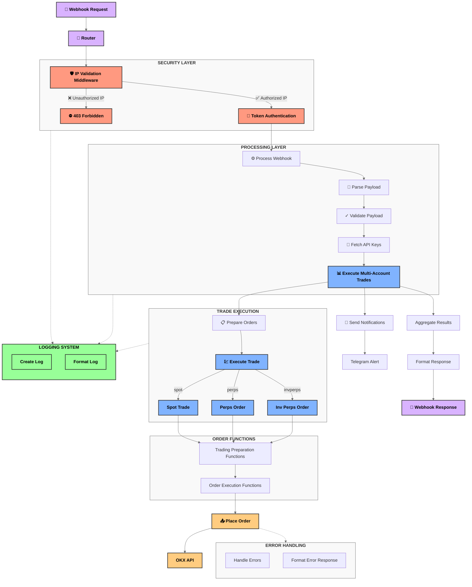

# Webhook API System Flow

This document provides a comprehensive overview of the webhook API system architecture, including all functions and their relationships.

## System Flow Diagram



## Function Categories

### Security Functions
- **🛡️ IP Validation Middleware**: Universal middleware that validates all incoming requests against the TradingView IP whitelist
- **🔑 Token Authentication**: Verifies the authentication token in the request payload
- **✓ Payload Validation**: Ensures the webhook payload contains all required fields and values

### Request Processing
- **⚙️ Process Webhook**: Main entry point for webhook processing
- **📝 Parse Payload**: Parses and validates the JSON payload
- **🔐 Fetch API Keys**: Retrieves API keys from the database

### Trade Execution
- **📊 Execute Multi-Account Trades**: Orchestrates trading across multiple accounts
- **💹 Execute Trade**: Routes trades to appropriate execution function based on type
- **Spot/Perps/Inv Perps Trade**: Specialized handlers for different trade types

### Order Processing
- **Calculate Order Size**: Determines order size based on available balance and requested percentage
- **Round to Lot Size**: Rounds order size to comply with exchange lot size requirements
- **Generate Client Order ID**: Creates a unique client order ID
- **📤 Place Order**: Sends the order to the OKX API

### API Interaction
- **Generate OKX Request**: Prepares authenticated requests to OKX API
- **Generate Signature**: Creates cryptographic signature for API requests
- **Fetch Max Size**: Retrieves maximum available size for trading
- **Get Instrument Info**: Gets instrument details like lot size and tick size

### Notification System
- **📨 Send Notifications**: Sends trade notifications
- **Format Trade Message**: Formats trade details for notifications
- **Telegram Alert**: Sends alerts to Telegram
- **Escape HTML**: Sanitizes HTML content for Telegram messages

### Logging System
- **Create Log**: Central logging function
- **Format Log Message**: Formats log messages with timestamp and context

### Utility Functions
- **Parse Float**: Safely parses float values
- **Generate UUID**: Generates unique identifiers
- **Sleep**: Implements delay for retry logic
- **Validate JSON**: Validates JSON strings
- **Format Date**: Formats dates for logging
- **Truncate String**: Truncates long strings for logging

## Data Flow

1. **Request Validation**:
   - 🔔 Webhook request → 📡 Router → 🛡️ IP Validation Middleware → 🔑 Token Authentication → ✓ Payload Validation

2. **Trade Processing**:
   - ⚙️ Process webhook → 🔐 Fetch API keys → 📊 Execute multi-account trades

3. **Order Execution**:
   - 📋 Prepare orders → 💹 Execute trade by type → 📤 Place orders → Aggregate results

4. **Notification & Response**:
   - Aggregate results → 📨 Send notifications → Format response → 📲 Return webhook response

## Security Layers

The system implements multiple security layers:

1. **🛡️ Universal IP Validation Middleware**: Outermost security layer that validates all requests against whitelist
   - Implemented with `router.all('*', ...)` to intercept all incoming requests
   - Applies to all routes and HTTP methods
   - Blocks unauthorized IPs with a 403 Forbidden response
   - Logs both successful and failed validation attempts

2. **🔑 Token-Based Authentication**: Inner security layer that verifies auth token
   - Uses constant-time comparison to prevent timing attacks
   - Works in conjunction with IP validation for defense-in-depth

3. **✓ Payload Validation**: Ensures all required fields are present and valid
   - Validates data types and formats
   - Prevents processing of malformed requests

4. **⚠️ Error Handling**: Comprehensive error handling and logging
   - Standardized error responses
   - Detailed logging of security events

## Middleware Implementation

The middleware-based security implementation offers several advantages:

1. **🔒 Universal Protection**: All routes are protected, regardless of HTTP method or path
2. **🔄 Consistent Security Controls**: Single implementation ensures uniform security validation
3. **🚫 Fail-Closed Architecture**: Blocks unauthorized requests before they reach any business logic
4. **🔧 Maintainability**: Security changes can be made in one place rather than in each route
5. **🛑 Reduced Risk**: Eliminates the possibility of adding routes that bypass security checks

The middleware is implemented as follows:

```javascript
router.all('*', async (request, env) => {
  const clientIp = request.headers.get('cf-connecting-ip');
  const ipAllowed = isAllowedIp(clientIp);
  
  // Log IP validation attempt
  console.log(`IP validation: ${clientIp} - ${ipAllowed ? 'allowed' : 'blocked'}`);
  
  if (!ipAllowed) {
    return new Response('Forbidden', { status: 403 });
  }
  
  // Continue processing the request
  return null;
});
```

## Logging & Monitoring

Logging is integrated throughout the system:
- 🛡️ Security events (IP validation, authentication attempts)
- 📊 Trade execution
- 🌐 API interactions
- ⚠️ Errors and exceptions

Enhanced logging for security events includes:
- IP validation results (success/failure)
- Client IP address
- User-Agent information for security incidents
- Request IDs for correlation

## Error Handling

The system includes robust error handling:
- ↩️ Retry logic for transient errors
- 📝 Comprehensive error logging
- 🔄 Standardized error responses
- 🔒 Security-focused error handling to prevent information leakage
